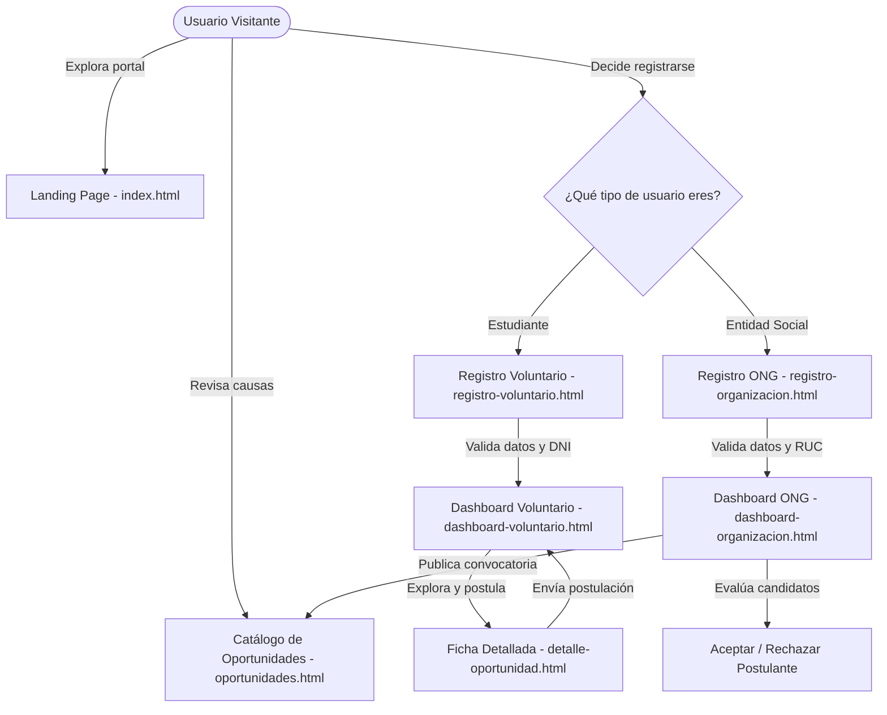

# MANUAL DE USUARIO
# Sistema Web de Voluntariado Local — VoluntMatch Cusco 🤝🇵🇪

---

## 📋 FICHA TÉCNICA DEL PROYECTO

| Parámetro | Detalle Institucional |
| :--- | :--- |
| **Institución Académica** | Universidad Continental — Sede Cusco |
| **Facultad / Escuela** | Facultad de Ingeniería / Ingeniería de Sistemas e Informática |
| **Asignatura** | Programación Web |
| **Docente** | Mg. Alfredo Collantes Mendoza |
| **Equipo de Desarrollo (Grupo 6)** | • **Alcca Moron, Piero Edu** (Líder Técnico & Frontend) • **Dueñas Quintana, Luis Angel** (Arquitecto de Software) • **Leguia Choquemamani, Patrick Antonio** (Diseñador UI/UX & CSS) • **Rojas Lopez, Alexis Sebastian** (Documentador Técnico & QA) |
| **Plataforma Web** | **VoluntMatch Cusco** |
| **Versión del Manual** | 1.0 (Borrador Oficial para Evaluación Semestral) |
| **Fecha de Emisión** | Octubre 2026 |

---

## 📑 TABLA DE CONTENIDOS

1. [Introducción y Objetivos de la Plataforma](#1-introducción-y-objetivos-de-la-plataforma)
2. [Requisitos del Entorno y Compatibilidad](#2-requisitos-del-entorno-y-compatibilidad)
3. [Estructura de Roles y Flujo de Usuario](#3-estructura-de-roles-y-flujo-de-usuario)
4. [Módulos del Sistema y Guía Paso a Paso](#4-módulos-del-sistema-y-guía-paso-a-paso)
   - 4.1. [Portal de Inicio (Landing Page)](#41-portal-de-inicio-landing-page-indexhtml)
   - 4.2. [Módulo de Registro de Estudiantes Voluntarios](#42-módulo-de-registro-de-estudiantes-voluntarios-registro-voluntariohtml)
   - 4.3. [Módulo de Registro de Organizaciones Sociales y ONGs](#43-módulo-de-registro-de-organizaciones-sociales-y-ongs-registro-organizacionhtml)
   - 4.4. [Módulo de Inicio de Sesión (Login Diferenciado)](#44-módulo-de-inicio-de-sesión-login-diferenciado-loginhtml)
   - 4.5. [Catálogo Interactivo de Oportunidades y Filtros](#45-catálogo-interactivo-de-oportunidades-y-filtros-oportunidadeshtml)
   - 4.6. [Ficha Técnica de Detalle y Postulación](#46-ficha-técnica-de-detalle-y-postulación-detalle-oportunidadhtml)
   - 4.7. [Panel de Control del Voluntario (Dashboard Estudiante)](#47-panel-de-control-del-voluntario-dashboard-estudiante-dashboard-voluntariohtml)
   - 4.8. [Panel de Control de la Organización (Dashboard ONG)](#48-panel-de-control-de-la-organización-dashboard-ong-dashboard-organizacionhtml)
   - 4.9. [Módulo de Contacto y Soporte Técnico](#49-módulo-de-contacto-y-soporte-técnico-contactohtml)
5. [Validaciones en Tiempo Real y Reglas de Negocio](#5-validaciones-en-tiempo-real-y-reglas-de-negocio)
6. [Preguntas Frecuentes y Solución de Problemas (FAQ)](#6-preguntas-frecuentes-y-solución-de-problemas-faq)
7. [Control de Cambios y Versiones](#7-control-de-cambios-y-versiones)

---

## 1. INTRODUCCIÓN Y OBJETIVOS DE LA PLATAFORMA

### 1.1. Resumen Ejecutivo
**VoluntMatch Cusco** es una plataforma web desarrollada para solucionar la desconexión existente entre la comunidad universitaria de Cusco y las entidades benéficas, albergues, comedores populares y ONGs locales. La plataforma proporciona un mecanismo de emparejamiento (*matching*) sustentado en criterios geográficos distritales (Cusco Centro, San Jerónimo, Wanchaq, Santiago), disponibilidad horaria y disciplinas académicas formativas (Educación, Sistemas e Informática, Medio Ambiente, Logística y Apoyo Social).

### 1.2. Objetivos del Sistema
- **Democratizar el acceso al voluntariado:** Permitir que cualquier estudiante universitario encuentre proyectos comunitarios validados en su distrito.
- **Optimizar la gestión de las organizaciones:** Dotar a las ONGs de herramientas digitales para publicar convocatorias, gestionar cupos y filtrar postulantes en tiempo real.
- **Trazabilidad y Reconocimiento:** Registrar de manera fidedigna las horas de labor social y el estado de participación estudiantil para fines de certificación y acreditación universitaria.

---

## 2. REQUISITOS DEL ENTORNO Y COMPATIBILIDAD

### 2.1. Requisitos de Software
| Componente | Requisito Recomendado |
| :--- | :--- |
| **Navegador Web** | Google Chrome 110+, Mozilla Firefox 110+, Microsoft Edge 110+ o Safari 16+. |
| **Soporte de Tecnologías** | Motor JavaScript (ES6+) habilitado de manera obligatoria. |
| **Almacenamiento Local** | Soporte activo de HTML5 `localStorage` (sin restricciones de modo incógnito estricto). |
| **Conexión a Internet** | Conexión activa para la descarga de hojas de estilo externas (Bootstrap 5.3 CDN) e iconografía (Bootstrap Icons). |

### 2.2. Diseño Responsivo y Resoluciones Soportadas
La interfaz fue concebida con un enfoque *Mobile-First*, adaptándose de forma fluida a través de Media Queries y CSS Grid:
- **Dispositivos Móviles:** 360px a 576px (menú hamburguesa retráctil, tarjetas en columna única).
- **Tablets e Interfaces Medianas:** 768px a 992px (grillas de 2 columnas).
- **Computadoras de Escritorio:** 1024px a 1440px+ (panel multipantalla de 3 columnas y filtros laterales fijos).

---

## 3. ESTRUCTURA DE ROLES Y FLUJO DE USUARIO

El sistema implementa tres niveles de interacción claramente diferenciados:

### 3.1. Matriz de Permisos por Rol

| Funcionalidad / Módulo | Visitante | Estudiante Voluntario | Organización / ONG |
| :--- | :---: | :---: | :---: |
| Explorar catálogo de oportunidades | ✅ Sí | ✅ Sí | ✅ Sí |
| Filtrar por área temática y distrito | ✅ Sí | ✅ Sí | ✅ Sí |
| Ver ficha de detalle de la convocatoria | ✅ Sí | ✅ Sí | ✅ Sí |
| Postularse a convocatorias | ❌ No | ✅ Sí | ❌ No |
| Visualizar historial y horas acumuladas | ❌ No | ✅ Sí | ❌ No |
| Publicar convocatorias con cupos | ❌ No | ❌ No | ✅ Sí |
| Aceptar / Rechazar postulantes | ❌ No | ❌ No | ✅ Sí |
| Envío de mensajes de soporte | ✅ Sí | ✅ Sí | ✅ Sí |

---

## 4. MÓDULOS DEL SISTEMA Y GUÍA PASO A PASO

---

### 4.1. Portal de Inicio (Landing Page — `index.html`)

El portal de inicio representa la carta de presentación del ecosistema VoluntMatch Cusco.

#### Componentes Principales:
1. **Barra de Navegación Superior (Header):**
   - Logo interactivo con insignia regional "Cusco".
   - Enlaces de salto directo: *Inicio*, *Oportunidades*, *Contacto* y *Cómo Funciona*.
   - Botón de acción principal: **Iniciar Sesión** y **Registrarse**.
   - En pantallas móviles: Botón hamburguesa accesible con alternancia de icono (`bi-list` a `bi-x-lg`).
2. **Sección Hero:**
   - Titular de alto impacto con llamada a la acción dual: botón verde **"Explorar Convocatorias"** y botón delineado **"Registrar mi Organización"**.
   - Estadísticas resumidas del impacto social en Cusco (+120 Voluntarios, +15 ONGs Aliadas, +850 Horas de Impacto).
3. **Sección "Cómo Funciona" (Proceso en 3 pasos):**
   - **Paso 1:** Encuentra tu causa afín por distrito y categoría.
   - **Paso 2:** Postula con un solo clic mediante tu cuenta universitaria.
   - **Paso 3:** Genera impacto real y acumula horas certificadas.
4. **Catálogo de Causas Destacadas:**
   - Despliegue de las 3 convocatorias más urgentes en Cusco, renderizadas dinámicamente desde el almacenamiento del cliente.
5. **Pie de Página Semántico (Footer):**
   - Enlaces rápidos, datos de la Universidad Continental y declaración de derechos reservados 2026.

---

### 4.2. Módulo de Registro de Estudiantes Voluntarios (`registro-voluntario.html`)

Diseñado para la incorporación de jóvenes universitarios a la base comunitaria.

#### Pasos para el Registro:
1. Haga clic en **"Registrarse"** o **"Soy Voluntario"** desde cualquier cabecera.
2. Complete los campos obligatorios del formulario:
   - **Nombre Completo:** Mínimo 3 caracteres alfabéticos.
   - **DNI:** Debe ingresar exactamente **8 dígitos numéricos** (RegEx: `/^\d{8}$/`).
   - **Correo Electrónico:** Formato de correo válido (ej. `nombre@continental.edu.pe`).
   - **Celular:** Debe contener **9 dígitos** e iniciar obligatoriamente con el dígito **9** (formato estándar Perú).
   - **Carrera Universitaria:** Seleccione su especialidad (*Ingeniería de Sistemas e Informática*, *Ingeniería Ambiental*, *Psicología*, *Educación*, etc.).
   - **Contraseña:** Mínimo 8 caracteres, combinando al menos una letra mayúscula, una minúscula y un número.
3. Marque la casilla obligatoria de aceptación de políticas y términos de privacidad.
4. Presione el botón verde **"Completar Registro"**.
5. **Resultado esperado:**
   - Si los datos son válidos, el sistema despliega una alerta de confirmación, guarda el perfil en `localStorage` y lo redirige automáticamente a su **Panel de Voluntario** (`dashboard-voluntario.html`).

---

### 4.3. Módulo de Registro de Organizaciones Sociales y ONGs (`registro-organizacion.html`)

Diseñado para albergues, fundaciones y colectivos sin fines de lucro de la región.

#### Pasos para el Registro Institucional:
1. Ingrese a través del enlace **"Soy ONG"** de la barra superior.
2. Complete la ficha técnica de la entidad:
   - **Razón Social / Nombre:** Nombre oficial de la organización (ej. *Hogar Infantil Azul Wasi*).
   - **RUC de la Organización:** Debe constar de exactamente **11 dígitos numéricos** e iniciar con **10** o **20** (RegEx: `/^(10|20)\d{9}$/`).
   - **Distrito en Cusco:** Seleccione su zona de operación (*Cusco Centro*, *San Jerónimo*, *Wanchaq*, *Santiago*, *San Sebastián*, *Saylla / Oropesa*).
   - **Teléfono Institucional:** 9 dígitos numéricos de contacto.
   - **Correo Electrónico Institucional:** Correo formal para avisos y recepción de postulaciones.
   - **Misión de la Organización:** Breve descripción de sus objetivos sociales (mínimo 20 caracteres).
   - **Contraseña:** Mínimo 6 caracteres alfanuméricos.
3. Presione el botón **"Registrar Organización"**.
4. **Resultado esperado:**
   - Confirmación de registro exitosa y redirección al **Panel de la Organización** (`dashboard-organizacion.html`).

---

### 4.4. Módulo de Inicio de Sesión (`login.html`)

Permite a los usuarios autenticados acceder a sus paneles de administración respectivos.

#### Instrucciones de Uso:
1. Ingrese a **"Iniciar Sesión"**.
2. **Selección de Rol (Paso Crítico):**
   - Active el botón radial **"Voluntario"** si es estudiante.
   - Active el botón radial **"ONG / Albergue"** si representa a una organización social.
3. Ingrese su correo electrónico y su contraseña.
   - *Nota de Demostración Académica:* El formulario incluye credenciales de prueba preconfiguradas para agilizar la sustentación (`70959838@continental.edu.pe` / `Contrasena123`).
4. Haga clic en **"Ingresar al Sistema"**.
5. **Enrutamiento Inteligente:**
   - El rol `Voluntario` es dirigido a `dashboard-voluntario.html`.
   - El rol `ONG` es dirigido a `dashboard-organizacion.html`.

---

### 4.5. Catálogo Interactivo de Oportunidades (`oportunidades.html`)

Módulo central de búsqueda y filtrado de causas sociales.

#### Guía de Exploración y Filtrado:
1. **Buscador en Tiempo Real:**
   - Ingrese una palabra clave en la caja de texto (ej. *"reforzamiento"*, *"verde"*, *"wanchaq"*). La grilla filtrará instantáneamente sin recargar la página.
2. **Filtros por Categoría Temática (Casillas de verificación múltiples):**
   - Puede marcar simultáneamente una o varias categorías:
     - 🎓 **Educación** (etiqueta azul)
     - 💻 **Sistemas** (etiqueta verde)
     - 🌿 **Medio Ambiente** (etiqueta esmeralda)
     - 📦 **Logística** (etiqueta naranja)
3. **Filtros por Distrito de Cusco (Botones de opción radial):**
   - Filtre geográficamente entre: *Todos los distritos*, *Cusco Centro*, *San Jerónimo*, *Wanchaq* o *Santiago*.
4. **Botón "Limpiar Filtros":**
   - Restablece todos los parámetros de búsqueda a su estado original.
5. **Lectura de Tarjetas:**
   - Cada tarjeta muestra la imagen ilustrativa, insignia temática, nombre de la ONG, distrito, horario semanal y el **indicador de cupos libres**. Si quedan 2 cupos o menos, el texto parpadeará en color ámbar/rojo con la clase indicadora `poco`.
6. Para conocer más detalles de una causa, presione el botón **"Ver Detalle"**.

---

### 4.6. Ficha Técnica de Detalle y Postulación (`detalle-oportunidad.html`)

Muestra toda la información contextual de la convocatoria seleccionada mediante el parámetro URL `?id=op-XXX`.

#### Elementos de la Ficha:
- **Encabezado:** Título del voluntariado, nombre de la ONG aliada y distrito cusqueño.
- **Detalle Operativo:** Modalidad (Presencial, Virtual o Híbrido), horario y cupos restantes.
- **Descripción del Proyecto:** Justificación comunitaria y contexto de la población beneficiaria.
- **Habilidades Requeridas:** Lista de competencias necesarias (ej. didáctica, manejo de bases de datos, trabajo en equipo).

#### Flujo de Postulación Rápida:
1. Presione el botón verde flotante **"¡Quiero Postular a este Voluntariado!"**.
2. Se abrirá una **ventana modal interactiva**:
   - Ingrese su nombre de estudiante y su correo universitario.
   - Opcionalmente agregue una breve motivación.
3. Presione **"Confirmar y Enviar Postulación"**.
4. El sistema:
   - Almacena la postulación en la clave `voluntmatch_postulaciones` con estado `"Pendiente"`.
   - Emite una notificación de éxito.
   - Redirige al estudiante a su panel para dar seguimiento a la solicitud.

---

### 4.7. Panel de Control del Voluntario (`dashboard-voluntario.html`)

Espacio privado del estudiante para monitorear su trayectoria solidaria.

#### Funcionalidades del Panel:
1. **Cabecera de Perfil:**
   - Muestra el nombre del estudiante (`Piero Edu Alcca`), su carrera (`Ingeniería de Sistemas e Informática`) y su universidad (`Universidad Continental`).
2. **Indicadores de Rendimiento (KPIs):**
   - **Horas Acumuladas:** Contador dinámico de horas certificadas completadas.
   - **Postulaciones Activas:** Cantidad de causas en trámite o en curso.
   - **Impacto Social:** Insignia de participación comunitaria en Cusco.
3. **Tabla de Seguimiento de Postulaciones:**
   - Columnas: *Causa Social*, *Organización*, *Fecha de Postulación*, *Horas Previstas* y *Estado de la Solicitud*.
   - **Estados Disponibles:**
     - 🟡 **Pendiente:** Solicitud enviada a la ONG, a la espera de evaluación.
     - 🟢 **Aceptado:** La ONG admitió al estudiante en el proyecto.
     - 🔵 **Finalizado:** Voluntariado concluido satisfactoriamente con horas sumadas.
4. **Acceso Rápido a Nuevas Convocatorias:** Botón directo al catálogo para seguir apoyando.
5. **Cerrar Sesión:** Botón **"Salir"** en la barra superior para finalizar la sesión segura.

---

### 4.8. Panel de Control de la Organización (`dashboard-organizacion.html`)

Herramienta de gestión para coordinadores de ONGs y centros sociales.

#### Funcionalidades de la Organización:
1. **Cabecera Institucional:**
   - Nombre de la entidad (`Hogar Infantil Azul Wasi`), RUC verificado y distrito sede.
2. **Botón "Publicar Nueva Convocatoria":**
   - Abre un formulario modal para redactar una nueva iniciativa social:
     - Título de la causa, categoría, distrito en Cusco, cupos totales, modalidad y horario.
   - Al guardar, la causa se inserta de inmediato en el catálogo de `oportunidades.html`.
3. **Métricas de la Entidad:**
   - *Convocatorias Activas*, *Postulantes Recibidos* y *Voluntarios Confirmados*.
4. **Gestión y Aprobación de Postulantes:**
   - Lista interactiva de estudiantes que solicitaron unirse a los proyectos de la ONG.
   - **Acción "Aceptar":** Cambia el estado del estudiante a "Aceptado", actualiza el contador de voluntarios e incrementa los cupos ocupados.
   - **Acción "Rechazar":** Descarta cordialmente la postulación y libera el cupo para otro postulante.

---

### 4.9. Módulo de Contacto y Soporte Técnico (`contacto.html`)

Canal de comunicación directa con los administradores y desarrolladores de VoluntMatch Cusco.

#### Pasos para Enviar una Consulta:
1. Ingrese a **"Contacto"** o **"Soporte"** desde el menú principal.
2. Llene los campos del formulario:
   - **Nombre:** Identificación del solicitante.
   - **Correo Electrónico:** Correo para recibir respuesta.
   - **Asunto:** Selección del motivo (*Duda sobre postulación*, *Inscripción de nueva ONG*, *Problema técnico*, *Alianzas institucionales*).
   - **Mensaje:** Descripción detallada de su consulta (mínimo 15 caracteres).
3. Presione el botón **"Enviar Mensaje"**.
4. El sistema valida las reglas sintácticas y emite una confirmación de despacho exitosa.

---

## 5. VALIDACIONES EN TIEMPO REAL Y REGLAS DE NEGOCIO

El motor `validaciones.js` aplica un estricto control de datos antes de permitir cualquier envío en el navegador:

| Campo Validado | Regla / Expresión Regular | Mensaje de Error Visible si Falla |
| :--- | :--- | :--- |
| **DNI (Estudiante)** | 8 dígitos exactos (`/^\d{8}$/`) | *"El DNI debe contener exactamente 8 dígitos numéricos."* |
| **RUC (Organización)** | 11 dígitos, inicia en 10 o 20 (`/^(10|20)\d{9}$/`) | *"El RUC debe tener 11 dígitos y empezar con 10 o 20."* |
| **Celular / Teléfono** | 9 dígitos, inicia con 9 (`/^9\d{8}$/`) | *"Ingresa un celular válido de 9 dígitos que inicie con 9."* |
| **Correo Institucional** | Formato RFC general o `@continental.edu.pe` | *"Ingresa un formato de correo electrónico válido."* |
| **Contraseña Segura** | Mínimo 8 caracteres, 1 mayúscula, 1 minúscula, 1 número | *"La contraseña debe tener al menos 8 caracteres, una mayúscula, una minúscula y un número."* |
| **Misión de la ONG** | Longitud de texto >= 20 caracteres | *"Describe brevemente la misión social de la ONG (mínimo 20 caracteres)."* |
| **Mensaje de Contacto** | Longitud de texto >= 15 caracteres | *"El mensaje debe tener al menos 15 caracteres."* |

---

## 6. PREGUNTAS FRECUENTES Y SOLUCIÓN DE PROBLEMAS (FAQ)

### ❓ 1. ¿Por qué mis postulaciones creadas desaparecen al cambiar de navegador o abrir una pestaña de incógnito?
> **Respuesta:** En esta etapa académica (Semana 08 / 50%), la persistencia de datos utiliza la tecnología **HTML5 `localStorage`** en el navegador del cliente. Los datos se mantienen guardados de forma indefinida en tu navegador habitual, pero una ventana en modo incógnito o un navegador diferente cuenta con su propio almacenamiento aislado e independiente.

### ❓ 2. ¿Cómo sé si mi postulación a una ONG fue aceptada?
> **Respuesta:** Ingresa con tu cuenta a `dashboard-voluntario.html`. En la tabla de seguimiento, el estado cambiará de la etiqueta amarilla **"Pendiente"** a la etiqueta verde **"Aceptado"** una vez que la ONG lo apruebe desde su panel.

### ❓ 3. ¿Qué hago si el botón "Ingresar al Sistema" me devuelve a la misma pantalla?
> **Respuesta:** Verifica que hayas seleccionado el **rol adecuado** (botón de radio Voluntario u ONG) y que tu correo y contraseña cumplan con el formato mínimo. Si algún campo tiene error, aparecerá resaltado con un borde rojo y un mensaje explicativo debajo.

### ❓ 4. ¿Puedo postularme a más de una convocatoria a la vez?
> **Respuesta:** Sí. VoluntMatch Cusco permite postular a múltiples causas siempre y cuando sus horarios semanales no se crucen entre sí.

---

## 7. CONTROL DE CAMBIOS Y VERSIONES

| Versión | Fecha | Autor(es) | Descripción del Cambio |
| :---: | :---: | :--- | :--- |
| **0.1-alfa** | 01/10/2026 | Dueñas Q. & Leguia C. | Estructuración inicial de vistas HTML semánticas y CSS Grid. |
| **0.5-beta** | 04/10/2026 | Alcca M. & Rojas L. | Integración de `main.js`, catálogo dinámico y simulación en `localStorage`. |
| **0.9-rc** | 05/10/2026 | Alcca M. | Módulo `validaciones.js` con expresiones regulares peruanas (DNI/RUC/Celular). |
| **1.0-oficial** | 06/10/2026 | Grupo 6 completo | Emisión del Manual de Usuario oficial y unificación de la documentación final. |

---

*Manual elaborado conforme a la rúbrica de evaluación de Programación Web — Universidad Continental Sede Cusco (2026).*
